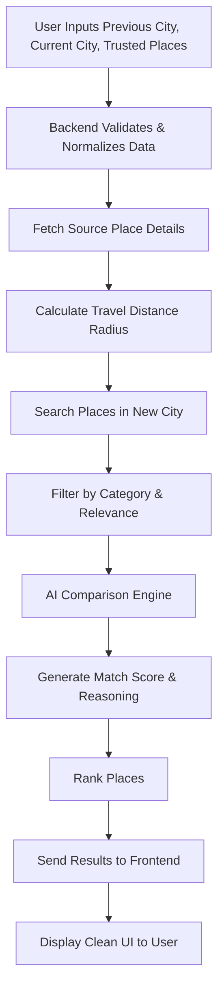

# 🌍 RelocAI — Smart Relocation Intelligence Platform

RelocAI is an AI-driven mobile application that helps users seamlessly transition to a new city by recommending places that match their existing lifestyle preferences.

---

## 🔗 Live Links

- 📱 Mobile App (APK Download)  
https://expo.dev/artifacts/eas/8LHXFDYxg21jmTDW99r5M3.apk  

- 🎥 Product Demo  
https://www.youtube.com/watch?v=qmkvW4GEPQo&t=7s Your lifestyle shouldn’t reset when you change cities.

RelocAI uses AI + geospatial intelligence to replicate your preferences in a new city.

---

## ⚙️ System Flowchart

---
 width="716" height="1600" alt="WhatsApp Image 2026-01-25 at 16 34 09 (2)" src="https://github.com/user-attachments/assets/f8f6a0d7-7b23-46be-b426-65f51b65f151" />

 
## 🚀 Core Workflow

1. Capture user relocation context  
2. Analyze travel behavior  
3. Discover similar places  
4. Compare using AI  
5. Rank and display results  

---

## 🧩 Tech Stack

- React Native (Expo)
- Node.js + Express
- Google Places API
- Google Distance Matrix API
- Gemini AI

---

## ✨ Features

- Personalized recommendations  
- AI-based ranking  
- Distance-aware suggestions  
- Clean mobile UI  

---

## 👨‍💻 Author

Rishabh Pandey
